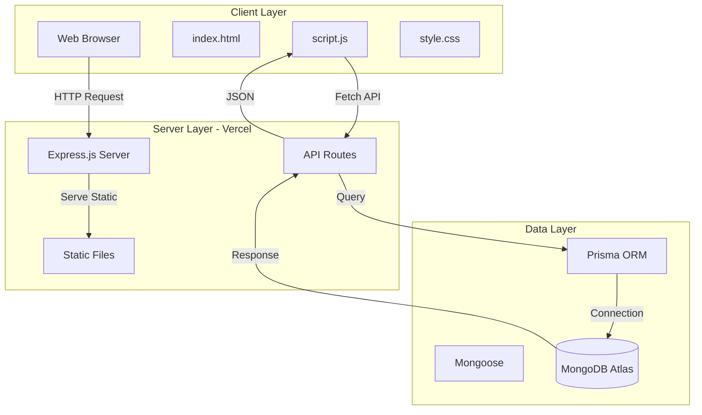

# System Design - Video Game Collection Manager

## Architecture Overview

## Component Breakdown

- **Frontend**: HTML5, CSS3, Vanilla JavaScript
- **Backend**: Node.js + Express.js (REST API)
- **Database**: MongoDB Atlas via Prisma ORM
- **Deployment**: Vercel (Serverless)
- **Version Control**: Git + GitHub